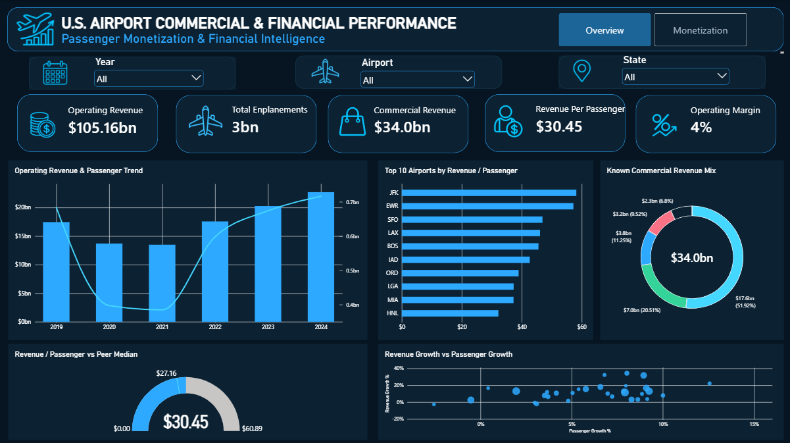
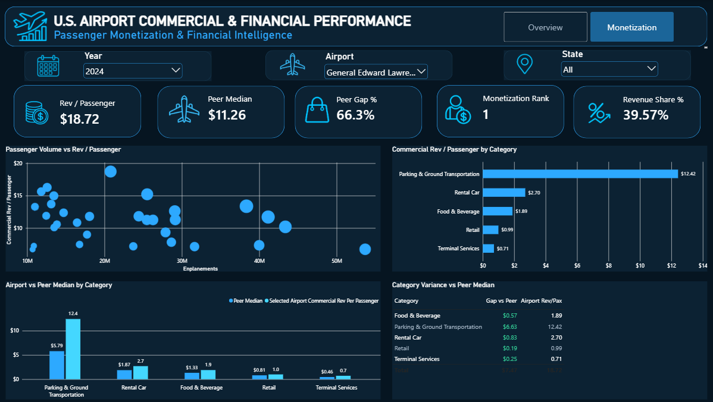
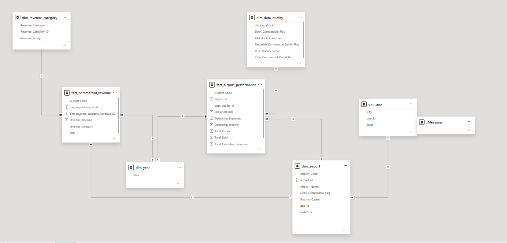

# ✈️ U.S. Airport Passenger Monetization & Financial Analysis

A data analysis project examining how major U.S. airports convert passenger traffic into commercial revenue and how their financial performance compares with peer airports.

The project analyzes **31 U.S. Large Hub airports from 2019–2024** using FAA airport financial data. It combines data preparation, dimensional modeling, DAX measures, peer benchmarking, and interactive Power BI dashboards to identify differences in passenger monetization and commercial revenue performance.

## 🛠️ Tools & Technologies

- Power BI
- Power Query
- DAX
- Excel
- Data Modeling
- Data Visualization
- Financial & Business Analysis

## 📊 Dashboard Overview

## Business Problem

Major U.S. airports can handle similar passenger volumes but still generate very different levels of revenue.

The goal of this project was to understand how well airports are converting passenger traffic into revenue, compare their performance with other large airports, and identify which commercial revenue categories are contributing to the differences.

## What I Did

I cleaned and prepared financial and passenger data for 31 large U.S. airports covering 2019 to 2024.

I then built a Power BI data model and created measures to analyze:

- Revenue per passenger
- Commercial revenue per passenger
- Operating margin
- Passenger and revenue growth
- Peer median performance
- Airport monetization ranking
- Commercial revenue performance by category

The dashboard is split into two pages. The first page looks at overall financial and passenger performance, while the second page focuses more closely on passenger monetization and peer comparison.

## Monetization Analysis

The second page focuses on how much commercial revenue airports generate from their passenger traffic.

It allows an airport to be compared with the peer median and shows which commercial revenue categories are performing above or below the benchmark.

## Data

The analysis uses FAA airport financial and passenger data for 31 large U.S. airports from 2019 to 2024.

The cleaned dataset includes airport-level information such as:

- Passenger enplanements
- Operating revenue
- Operating expenses
- Operating income
- Capital expenditure
- Commercial revenue by category
- Airport and location details

The commercial revenue analysis currently focuses on five verified categories:

- Parking & Ground Transportation
- Rental Car
- Food & Beverage
- Retail
- Terminal Services

## Data Model

I used a dimensional model in Power BI with separate fact and dimension tables.

The model includes:

- Airport dimension
- Year dimension
- Revenue category dimension
- Geography dimension
- Data quality dimension
- Airport performance fact table
- Commercial revenue fact table

